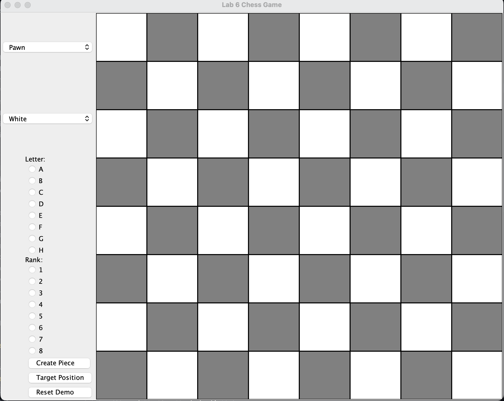

# Chess_GUI

This project is a chess game implemented in Java using a graphical user interface (GUI). Instead of a full chess game with two players, this program allows users to select individual chess pieces, choose their starting positions, and test if they can legally move to a target position. The GUI responds with either a success message (and the piece moves) or an invalid move message (and the board remains unchanged).

## Features

- **Piece Selection**: The user can select from various chess pieces (Pawn, Rook, Knight, etc.) using a dropdown menu.
- **Position Selection**: The user selects both the initial position and the target position using radio buttons for columns (A-H) and rows (1-8).
- **Movement Validation**: Once the user chooses the target position, the program checks if the selected piece can legally move to that position.
  - If the move is valid, the piece moves to the new location on the chessboard, and a message confirms the move.
  - If the move is invalid, the board stays unchanged, and a message notifies the user of the invalid target.

## How to Play

1. **Select a Chess Piece**: Choose a piece from the dropdown menu on the left side of the window (e.g., Pawn, Rook, Knight, etc.).
   
2. **Set Initial Position**: Use the radio buttons labeled "Letter" (for columns A-H) and "Rank" (for rows 1-8) to specify the piece's starting position on the board.

3. **Create Piece**: Press the "Create Piece" button to place the selected piece on the board at the specified position.

4. **Select Target Position**: After the piece is placed, select a target position for it using the same set of radio buttons.

5. **Validate Move**: Press the "Target Position" button to check if the piece can move to the specified position.
   - If the move is valid, the piece will move, and a message will confirm the successful move.
   - If the move is invalid, a message will inform you that the piece cannot move there, and the board will remain unchanged.

6. **Reset Demo**: Use the "Reset Demo" button to clear the board and start over with a new piece selection.

## Screenshot



*Screenshot of the chess game GUI, showing the controls for selecting pieces and positions.*

## Requirements

- **Java 8+**: This project requires Java 8 or newer versions to run.
- **Java Swing**: The graphical user interface is built using Java Swing components.

## How to Run

1. Clone the repository:
   ```bash
   git clone https://github.com/GusBuzzz/Chess_GUI
   ```

2. Compile the Java files:
   ```bash
   javac Main.java
   ```

3. Run the program:
   ```bash
   java Main
   ```

## Future Improvements

- Add functionality for multiple pieces on the board at the same time.
- Implement full game logic with turns for two players.
- Add support for special moves like castling, en passant, and pawn promotion.
